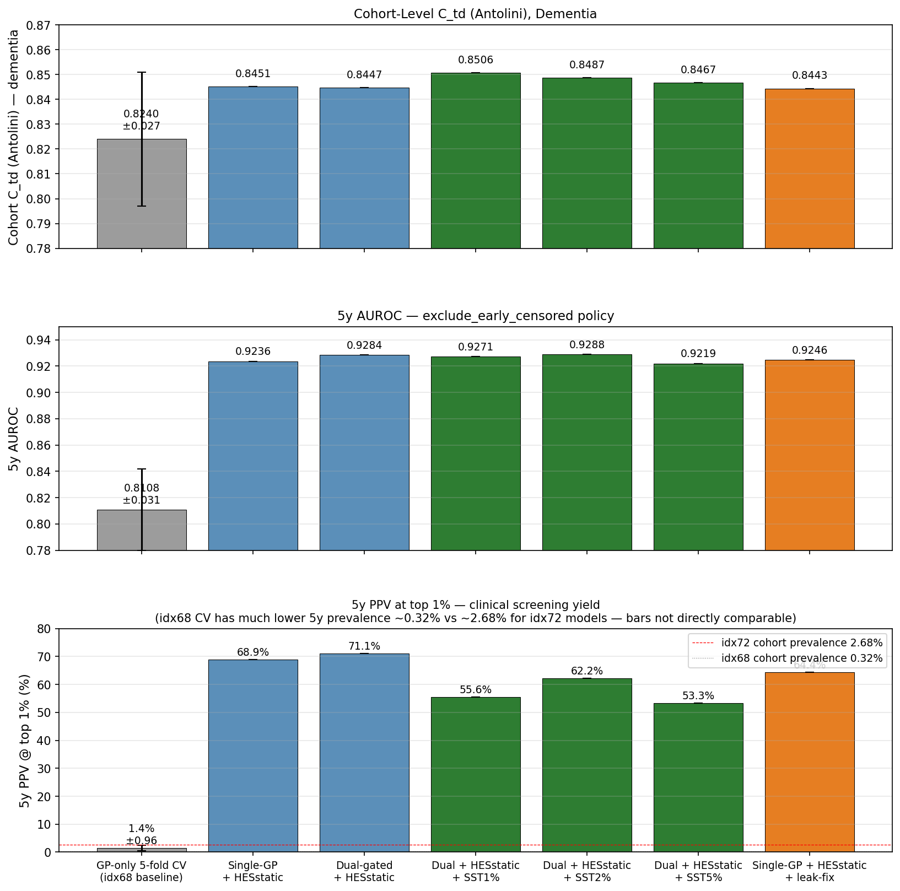
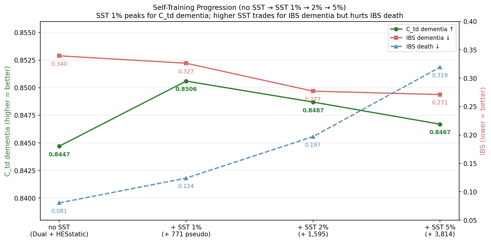
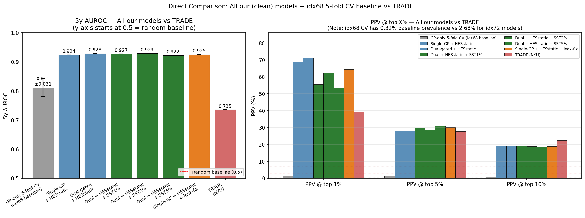
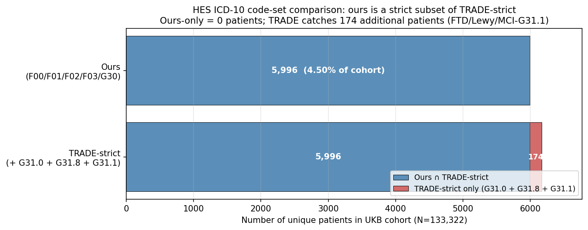

# Dementia Risk Prediction with the SurvivEHR Foundation Model on UK Biobank Linked Primary Care + Hospital Data

## Progress Report

**Cohort**: UK Biobank linked GP primary-care + HES hospital records (n = 133,322)
**Report date**: 2026-05-15

---

## 1. Executive Summary

We are building a competing-risk dementia prediction model on UK Biobank–linked **GP primary-care records** (Read v2 / CTV3, ~133K cohort patients) and **HES hospital records** (ICD-10). The model uses the **SurvivEHR architecture** (Gadd et al., 2025, medRxiv) — a GPT-style transformer foundation-model for EHR time-to-event prediction — pretrained on our local UKB GP records and fine-tuned for dementia. It outputs a full **25-year cumulative incidence function (CIF)** for both dementia and competing death via a DeSurv ODE head.

The two strongest results on the canonical 8,241-patient test cohort are summarised below. Neither model wins every metric: **Single-GP + HESstatic** is best on top-1% PPV (clinical screening yield) and on dementia IBS calibration; **Dual + HESstatic + SST1%** is best on time-dependent C-index (overall discrimination) and on broader-cut PPV (top 5%).

| Metric (5-year horizon) | Single-GP + HESstatic *(clean baseline; best top-1% PPV, best IBS dem)* | Dual (GP+HES) + HESstatic + 1% SST *(best C-index, best PPV@5%)* |
|---|---|---|
| Time-dependent C-index (Antolini), dementia | 0.8451 | **0.8506** |
| C-index, death | **0.9622** | 0.9589 |
| Integrated Brier Score, dementia (lower = better) | **0.3152** | 0.3265 |
| 5-year AUROC (binary, exclude_early_censored) | 0.9236 | **0.9271** |
| 5-year PPV @ top 1% / 5% / 10% | **68.9%** / 27.9% / 19.0% | 55.6% / **29.7%** / 19.3% |

For external context, the most directly comparable foundation-model EHR paper, **TRADE** (Wisnivesky et al., NYU AD/ADRD/MCI prediction), reports 5y AUROC = 0.735 and PPV@top 1% = 39.2%. Detailed code-set overlap analysis (§8) confirms our HES dementia label is a near-strict subset of TRADE's umbrella, with the main gaps being MCI (no UK ICD-10 equivalent) and FTD/Lewy body sub-codes (~160 extra patients available if we extend our label).

---

## 2. Data Sources

### 2.1 The two data sources

We use **two UK Biobank–linked sources**:

1. **UKB-linked GP primary-care extract** — General Practice records (Read v2 / CTV3 clinical coding) covering 502,246 UKB participants in total (of which 230,001 have ≥1 diagnostic record). Contains the full longitudinal record of GP encounters: diagnoses, prescriptions, lab tests, lifestyle observations, referrals, and administrative events.
2. **UKB-linked HES (Hospital Episode Statistics)** — Secondary-care records (ICD-10 diagnoses, OPCS-4 procedures) covering 448,985 UKB participants. Contains admission dates, primary/secondary diagnosis lists, and operation lists.

The two sources are linked at the patient level via UKB's encrypted participant ID.

### 2.2 GP primary-care record is NOT just diagnoses

A common misunderstanding is that GP records contain only diagnosis codes. In reality, the Read v2 vocabulary used in UK GP systems contains **108,118 distinct tokens** in our pretrained model's vocabulary, spanning a wide range of clinical event types.

Read v2 uses semantic prefixes to group code categories. The main chapters are roughly:

| Chapter prefix | Category |
|---|---|
| `1...` | History and process codes (symptoms, presenting complaint) |
| `2...` | Examination findings, physical measurements (BP, weight, BMI) |
| `3...` | Diagnostic procedures (ECG, imaging) |
| `4...` | Laboratory tests (blood, urine, etc.) |
| `6...` | Administrative / preventive (screening, counselling) |
| `8...` | Other procedures (vaccinations, minor surgery) |
| `9...` | Administrative (letters, referrals, registrations) |
| `B...` | Neoplasms |
| `E...` | Mental disorders |
| `F...` | Nervous system (incl. dementia) |
| `G...` | Circulatory (cardiovascular) |
| `H...` | Respiratory |
| `J...` | Digestive |
| `K...` | Genitourinary |
| `Eu0..` | ICD-10 mapped mental disorders (incl. dementia F00-F09) |

So in the GP record stream one can see: a diagnostic code (e.g., `G20..` essential hypertension), then a blood test result (`44..` cholesterol), then a prescription, then a referral letter (`9..`), then a measurement (`229..` body weight), etc. The model sees this **chronologically ordered stream** of event codes + dates + numeric values (where applicable), **not** an aggregated feature vector.

**Example patient (anonymised, real record from our test cohort):**

```
PATIENT_ID:    2442387
YEAR_OF_BIRTH: 1941    SEX: M    IMD: 3    ETHNICITY: White British
INDEX_DATE:    2013-01-01 (= 72nd birthday)

Total GP events recorded:      379 events from 1961-01-01 to 2012-12-31
HES pre-index admissions:      4 (HES_TOTAL_ADMISSIONS scaled = 0.279)
HES comorbidity flags:         none of stroke/MI/HF/HT/diabetes etc. set

First 10 GP events (chronological), raw codes:
  1961-01-01   J16y4
  1971-01-01   H51..
  1974-01-01   G20..
  2000-01-01   1241.
  2000-01-01   12C1.
  2000-01-01   12C3.
  2000-01-01   12A1.
  2000-01-01   12C4.
  2002-12-01   G5y34
  2005-08-01   J51..
... (total 379 events; final event determines the patient's outcome label)
```

The descriptive labels for each Read v2 code are NOT used by the model — the model only sees the raw code tokens. Translation of any specific code to a description requires a Read v2 dictionary lookup (we have not embedded such a dictionary in the report, as the model does not rely on it).

### 2.3 Cohort composition

| Stage | Patient count |
|---|---|
| Total UKB-linked GP primary-care database (`static_table`, all UKB participants with GP linkage) | **502,246** |
| Of these, with ≥1 diagnostic record in `diagnosis_table` | 230,001 |
| Total UKB-linked HES hospital database | **448,985** |
| In BOTH GP and HES (HES is a subset of the GP-linked set) | 448,985 |
| GP-only (no HES linkage) | 53,261 |
| Meeting study inclusion (≥1y GP registration, ≥5 events before idx 72, idx age in 50-90) | **133,322** |
| After GP-prevalent dementia leakage removal (cleanest cohort) | **133,076** |

**Dementia capture by data source** (in the full UKB linkage layer, before applying our cohort filter):

| Source | Dementia patients | Note |
|---|---|---|
| GP (31 strict Read v2 dementia codes) | **992** | Formal GP-coded dementia |
| HES (F00.*, F01.*, F02.*, F03, G30.*) | **8,941** | Hospital ICD-10 dementia |
| In BOTH GP and HES | 781 | |
| GP-only | 211 | |
| HES-only | 8,160 | **HES catches ~9× more dementia than GP** |
| **Total unique (GP ∪ HES)** | **9,152** | |

**Key finding**: HES catches **almost an order of magnitude more dementia patients than GP**. UK GP records substantially under-code dementia — patients are often diagnosed in memory clinics or hospital admissions (which goes to HES) but the GP record is never updated. This is consistent with the well-documented 30–50% GP under-diagnosis rate (Lang 2017; Connolly 2011) and strongly motivates the self-training pipeline.

**Within our 133,322 study cohort** (subset of the 502,246 full linkage after applying inclusion criteria: idx age 72, ≥1y GP registration, ≥5 events before index):

| Has data in | Patients (% cohort) |
|---|---|
| GP records (all 133,322 must have GP — inclusion criterion) | 133,322 (100%) |
| With ≥1 valid ICD-10 HES record (any time) | 126,530 (94.9%) |
| GP-only dementia (31 strict, not in HES) | 162 (0.12%) |
| HES-only dementia (not in GP) | 5,477 (4.11%) |
| Both GP and HES dementia | 519 (0.39%) |
| **Total dementia patients (GP ∪ HES, ever)** | **6,158 (4.62%)** |

The 6,158 within-cohort number is smaller than the 9,152 full-linkage number because **the inclusion criteria drop 2,994 dementia patients** who fail one or more criteria (e.g., do not have a GP visit at age 72, insufficient GP registration history, or fewer than 5 pre-index events). The within-cohort prevalence (4.62%) is approximately 2× the UK general elderly baseline because we deliberately recruited at age 72.

### 2.4 Train / Val / Test split

Splits are made at the **GP practice level** (`PRACTICE_ID`), not at the patient level. All patients in a given practice go to the same split. This prevents practice-level data leakage (e.g., regional coding patterns, practice-specific terminology).

| Split | Patients | Dementia events | Death events | Censored |
|---|---|---|---|---|
| Train | 119,271 | 5,286 | 7,898 | 106,087 |
| Val | 5,794 | 296 | 485 | 5,013 |
| Test | 8,257 | 376 (370 after canonical filter to 8,241) | 451 | 7,430 |
| **Total** | **133,322** | **5,958** | **8,834** | **118,530** |

Dementia event prevalence across the full cohort = 5,958 / 133,322 = **4.47%**; death prevalence = 6.63%; censored = 88.91%. Splits are approximately stratified by event rate.

(Note: 5,958 incident dementia events vs 6,158 patients with any dementia code in GP/HES history — see §2.3 — differ by ~200. The gap is patients whose dementia code occurs before the prediction point, or who die from another cause first; these are not labeled as "incident dementia event" in the V2 dataset.)

**⚠️ Important caveat about train/val/test cleanliness**: The 246 GP-prevalent dementia patients (213 train / 17 val / 16 test) — i.e., patients whose dementia code appears **before** the prediction point — are present in the V2 dataset and were used to train all five "V2 clean labels" post-leakage models (Single-GP + HESstatic through Dual + HESstatic + SST5%). **Only the test set is filtered** to the canonical 8,241 = 8,257 − 16 for evaluation. The "leakage-fixed" base dataset that removes all 246 patients is used by the most recent model **Single-GP + HESstatic + leak-fix** (§5, §7.1). All test-cohort metrics in §7.1 are therefore on the same canonical 8,241 patients; training-set leakage of 213+17 = 230 patients (0.18% of train+val) was tolerated in the V2-labelled comparison set to keep model comparisons consistent with our historical experimental record.

---

## 3. Label Definition

### 3.1 Index date and prediction setup (important clarification)

The study fixes **age 72 as the cohort entry date** for inclusion (all patients must have at least one GP visit at age 72), but this is **not the prediction time-point**. The model performs **dynamic prediction**:

```
Past:  [........ GP events ........]
                                   ↑
                          Prediction point = the patient's most recent
                          pre-index GP encounter (often months/years BEFORE age 72)

Future: [...]→ dementia / death / censored
        time = days from prediction point (NOT from age 72)
```

The model emits CIF over `t = 0 → 25 years from the prediction point`. This matches how the model is actually deployed: a clinician asks "given everything I know about this patient up to today, what is their risk over the next N years?" — not "what is their risk from a fictitious cohort entry date."

The "index age 72" is used only for **inclusion / exclusion**, not for time origin. Events occurring before the prediction point are model input; events occurring after are target outcomes.

### 3.2 Dementia label: GP side (41 Read v2 codes)

The full list of Read v2 / CTV3 codes used to identify dementia events on the GP side, with **patient counts in the raw GP database (230,001 patients with diagnostic records, drawn from the 502,246 UKB-linked GP cohort)** — note: these are unique-patient counts, not event counts.

| Read code | Patients | Description |
|---|---|---|
| F110. | 449 | Alzheimer's disease (neurology chapter) |
| Eu00. | 220 | Dementia in Alzheimer's disease (ICD-10 F00 umbrella) |
| Eu01. | 78 | Vascular dementia (F01 umbrella) |
| Eu02z | 70 | Unspecified dementia (F02.9 default) |
| Eu002 | 60 | Dementia in AD, atypical or mixed type (F00.2) |
| Eu057 | 57 | Mild cognitive disorder — closest available to MCI (F06.7) |
| E00.. | 54 | Senile/presenile organic psychotic conditions (umbrella) |
| Eu023 | 49 | Dementia in Parkinson's disease (F02.3) |
| Eu00z | 45 | Dementia in AD, unspecified (F00.9) |
| Eu04. | 17 | Delirium (F05) — broader organic |
| Eu025 | 15 | Dementia in other specified diseases (F02.5) |
| Eu01z | 13 | Vascular dementia, unspecified (F01.9) |
| E001. | 13 | Presenile dementia |
| F1100 | 12 | Alzheimer's, early onset |
| Eu001 | 10 | Dementia in AD, late onset (F00.1) |
| E004. | 8 | Arteriosclerotic dementia |
| Eu053 | 8 | Organic mood disorders (F06.3) |
| Eu000 | 7 | Dementia in AD, early onset (F00.0) |
| Eu04z | 7 | Delirium, unspecified |
| Eu02. | 6 | Dementia in other diseases (F02 umbrella) |
| Eu013 | 5 | Mixed cortical/subcortical vascular dementia (F01.3) |
| E000. | 5 | Uncomplicated senile dementia |
| Eu0z. | 5 | Unspecified organic mental disorder |
| Eu060 | 5 | Organic personality disorder (F07.0) |
| Eu054 | 5 | Organic anxiety disorder (F06.4) |
| Eu05y | 4 | Other organic mental disorders |
| Eu052 | 4 | Organic delusional disorder |
| Eu01y | 3 | Other vascular dementia |
| E001z | 3 | Presenile dementia NOS |
| Eu062 | 3 | Postconcussional syndrome (F07.2) |
| F1101, Eu020 (Pick's / FTD), E004z, E0021 | 2 each | rare codes |
| Eu02y, Eu012, Eu011, E00z., E0040, E003., E0020 | 1 each | very rare |

**Union of any of 31 strict dementia codes in the 230K GP DB: 992 patients (0.43%)**

**Union of all 41 codes (incl. 10 broader organic): 1,077 patients (0.47%)**

**Within our 133K study cohort: 681 (31-strict) / 722 (all 41) patients** — i.e., only ~0.5% of cohort has any GP-coded dementia.

Notes:
- UK GPs overwhelmingly use `F110.` (Alzheimer's) and the `Eu0..` family, with most patients coded under the unspecified subcategory (`Eu02z`, `Eu00z`). Fine-grained subtype coding (specific vascular subtypes, etc.) is rare.
- The "broader organic" 10 codes (Eu04, Eu05y, Eu057, Eu060, etc.) add only ~80 patients beyond the 31 strict codes.
- **GP-coded dementia is rare in this cohort** because of well-documented GP under-coding: many patients are diagnosed in memory clinics / hospitals (going to HES) but the GP record is never updated. See §2.3 — HES catches ~9× more dementia.

### 3.3 Dementia label: HES side (ICD-10)

HES uses WHO ICD-10. We use the standard "broad dementia" definition:

| ICD-10 family | Patients | %cohort | Description |
|---|---|---|---|
| F00.* (F00.0, F00.1, F00.2, F00.9) | 2,288 | 1.72% | Dementia in Alzheimer's disease |
| F01.* (F01.0, F01.1, F01.2, F01.3, F01.8, F01.9) | 1,417 | 1.06% | Vascular dementia |
| F02.* (F02.0, F02.1, F02.2, F02.3, F02.8) | 708 | 0.53% | Dementia in other diseases (Pick's, Huntington's, CJD, Parkinson's, etc.) |
| F03 | 3,048 | 2.29% | Unspecified dementia |
| G30.* (G30.0, G30.1, G30.8, G30.9) | 2,817 | 2.11% | Alzheimer's disease |

**Union of any HES dementia code: 5,996 patients (4.50% of cohort)**

**Combined GP + HES dementia label in the cohort**:

| | n | %cohort |
|---|---|---|
| GP-only (31-strict GP code, no HES dementia code) | 162 | 0.12% |
| HES-only (HES dementia code, no GP code) | 5,477 | 4.11% |
| Both GP and HES | 519 | 0.39% |
| **Union (any source)** | **6,158** | **4.62%** |

Within the test cohort (n=8,241), after restricting to events occurring **after** the prediction point and before death, this yields **370 incident dementia events** (i.e., true "future dementia" labels for evaluation).

### 3.4 22-dim HES static covariates (handcrafted features)

In addition to feeding GP event sequences into the transformer, we compute a 22-dimensional patient-level summary vector from pre-index HES records (strict temporal filter — `admidate < index_date`). Dementia codes (F00-F03, G30) are **excluded** from these features to prevent label leakage.

The 22 features:

| # | Feature | Type | ICD-10 prefix |
|---|---|---|---|
| 0 | HES_TOTAL_ADMISSIONS | log-scaled count |  |
| 1 | HES_TOTAL_UNIQUE_DIAG | log-scaled count |  |
| 2 | HES_HAS_STROKE | binary | I60-I69 |
| 3 | HES_HAS_MI | binary | I21-I22 |
| 4 | HES_HAS_HEART_FAILURE | binary | I50 |
| 5 | HES_HAS_DIABETES | binary | E10-E14 |
| 6 | HES_HAS_DELIRIUM | binary | F05 |
| 7 | HES_HAS_TBI | binary | S06 |
| 8 | HES_HAS_HYPERTENSION | binary | I10-I15 |
| 9 | HES_HAS_ATRIAL_FIBRILLATION | binary | I48 |
| 10 | HES_HAS_CKD | binary | N18 |
| 11 | HES_HAS_DEPRESSION | binary | F32, F33 |
| 12 | HES_HAS_PARKINSON | binary | G20 |
| 13 | HES_HAS_EPILEPSY | binary | G40, G41 |
| 14 | HES_HAS_OBESITY | binary | E66 |
| 15 | HES_HAS_HYPERLIPIDEMIA | binary | E78 |
| 16 | HES_HAS_COPD | binary | J44 |
| 17 | HES_HAS_ALCOHOL | binary | F10 |
| 18 | HES_HAS_SLEEP_DISORDER | binary | G47 |
| 19 | HES_MEAN_STAY_DAYS | log-scaled continuous |  |
| 20 | HES_EMERGENCY_RATIO | continuous [0,1] | admimeth 21-28 |
| 21 | HES_YEARS_SINCE_LAST_ADMISSION | scaled continuous |  |

These 22 dimensions are concatenated with 27 baseline demographic dimensions (SEX one-hot, IMD one-hot, ETHNICITY one-hot, YEAR_OF_BIRTH scaled) to form a **49-dim static covariate vector** that is projected to the model's embedding space and **added to every token embedding** in the sequence.

---

## 4. Model Architecture

### 4.1 Pretraining (done locally on UKB data, frozen backbones)

We use the **SurvivEHR architecture** (Gadd et al., 2025) and pretrain it from scratch on our own UKB-linked data. We do **not** use the SurvivEHR authors' public CPRD-pretrained weights.

**GP backbone pretrain** (`crPreTrain_small_1337.ckpt`):
- Self-supervised next-event prediction with competing-risk time-to-event objective
- Data: full UKB-linked GP `example_exercise_database.db` (≈502K patients in `static_table`, ~230K with diagnostic records)
- Vocabulary: 108,118 tokens (Read v2 / CTV3)
- Architecture: 6 transformer layers, 6 heads, 384 embedding dim
- Block size: **256** at pretrain (matches `config_CompetingRisk11M.yaml`); the same checkpoint is re-used at block size 512 in fine-tune (positional encoding generalises)
- Pretrain hyperparameters: batch 64, see config file for further details

**HES backbone pretrain** (`crPreTrain_HES_1337.ckpt`):
- 419,966 patient HES sequences, ~3.9M events total
- 1,499-token vocabulary (ICD-10, 3-character truncated)
- Same transformer architecture, block size 256
- Trained for 8 epochs with early-stopping (config target was 15, best checkpoint = `crPreTrain_HES_1337-epochepoch=07.ckpt`), batch 64

### 4.2 Fine-tuning architectures

Two backbone configurations:

**Single-backbone (GP-only) fine-tune** (used in **Single-GP + HESstatic**, the just-trained **Single-GP + HESstatic + leak-fix**, and the planned SST1% extension):

```
GP token sequence (≤512 tokens) → GP Backbone (pretrained, frozen-then-LR-warmed)
                                → patient embedding h_gp (384-dim)
49-dim static covariates (incl. 22 HES summary) → Linear(49→384) → static embedding
                                → SUMMED with every position's token embedding
                                → DeSurv ODE Competing-Risk Head
                                → CIF_dementia(t), CIF_death(t)   for t ∈ [0, 25y]
```

**Dual-backbone fine-tune** (used in **Dual-gated + HESstatic** and its SST variants):

```
GP data → [GP Backbone, 108K vocab, block 512] → h_gp (384-dim) ─┐
                                                                  ├─ Gated Fusion → h_fused → DeSurv → CIF
HES data → [HES Backbone, 1.5K vocab, block 256] → h_hes (384-dim) ─┘

Gated fusion:
   gate = σ(W_g · [h_gp; h_hes])
   h_fused = gate ⊙ W_gp(h_gp) + (1-gate) ⊙ W_hes(h_hes)
```

Both backbones have their own 49-dim and 27-dim static covariate projections respectively. Total dual-model parameters: ~106M trainable.

### 4.3 DeSurv competing-risk head

- Gaussian-mixture distribution over time
- Fixed-step ODE solver integrates the mixture into a cumulative incidence function
- Two cause-specific outputs satisfying CIF_dem(t) + CIF_death(t) ≤ 1 by construction
- Time scaling: `time_scale (days) = 1825 × supervised_time_scale (5) = 9,125 days ≈ **25 years**`
- Output grid: 1,000 evenly-spaced points on `t_eval ∈ [0, 1]` (= 0 to 25 years)

### 4.4 Self-training (SST) — iterative 3-round procedure

To address the well-documented under-diagnosis of dementia in primary care (30–50% missing, Lang 2017; Connolly 2011), we apply **three iterative cumulative self-training rounds** on top of the base dual-backbone model. Each round uses the **previous round's trained model** for inference and adds new pseudo-positives on top of the previous round's pseudo set.

```
Round 0 (base):  Train Dual-gated + HESstatic on V2 clean labels (real events only).

Round 1 (SST1%): - Use Round-0 model to infer dementia CIF on the training set.
                 - Among censored patients, select top-1%-threshold = 771 patients.
                 - Sample pseudo event times from the empirical alive-censored lag
                   distribution (n=3,637, median 8.8 years, max ~16 years).
                 - Retrain on (real events ∪ 771 pseudo).
                 - Output: "Dual + HESstatic + SST1%" (= 771 pseudo total).

Round 2 (SST2%): - Use Round-1 model to infer on training set.
                 - Add NEW 824 pseudo-positives (top-2% threshold), distinct from R1.
                 - Retrain on (real events ∪ R1 pseudo ∪ R2 new pseudo).
                 - Output: "Dual + HESstatic + SST2%" (= 1,595 pseudo total).

Round 3 (SST5%): - Use Round-2 model to infer.
                 - Add NEW 2,219 pseudo-positives (top-5% threshold).
                 - Retrain on (real ∪ R1 ∪ R2 ∪ R3 new pseudo).
                 - Output: "Dual + HESstatic + SST5%" (= 3,814 pseudo total).
```

For each pseudo-positive, the event time is set as `prediction_point + sampled_lag`, where the lag is drawn (with seed=1337) from the empirical alive-censored lag distribution. CIF is queried at the model's maximum supervised horizon (`t_eval[-1]`, normalised → 25 years) for ranking.

The just-trained "Single-GP + HESstatic + leak-fix" model (§7.1) is the leakage-cleaned base on top of which the single-round SST will be applied next (planned, §5 last row).

### 4.5 Training hyperparameters

| | Value |
|---|---|
| Per-GPU batch size | 16 (dual) / 32 (single) |
| Effective batch (after grad-accum) | 16×32 = 512 (dual), or 32×16 = 512 (single) |
| Learning rate (backbone) | 5e-5 |
| Learning rate (survival head) | 5e-4 (10× backbone) |
| Optimizer | AdamW |
| Scheduler | ReduceOnPlateau (factor 0.8) |
| Epochs | up to 25, early-stop patience 10 |
| Seed | 1337 |
| Hardware | 1× NVIDIA GPU (24 GB), 48 CPUs |

---

## 5. Experiments

Each experiment is identified below by its architecture configuration. Each name encodes whether the GP-only or dual backbone is used, whether HES static features are included, and whether self-training pseudo-labels are added.

| Short name | Architecture | Label dataset | Self-training |
|---|---|---|---|
| **Single-GP + HESstatic** | Single GP backbone + 22-dim HES static *(no HES backbone)* | V2 clean labels | — |
| **Dual-gated + HESstatic** | Dual GP+HES backbones, gated fusion + 22-dim HES static | V2 clean | — |
| **Dual + HESstatic + SST1%** | Above + top-1% pseudo-positive SST round | V2 clean + 771 pseudo | 1% top |
| **Dual + HESstatic + SST2%** | Above + top-2% SST round | V2 clean + 1,595 pseudo | 2% top |
| **Dual + HESstatic + SST5%** | Above + top-5% SST round | V2 clean + 3,814 pseudo | 5% top |
| **Single-GP + HESstatic + leak-fix** *(just trained)* | Single GP + 22-dim HES static, **GP-prevalent leakage removed** (246 leaky patients) | V2 cleanest | — |
| **Single-GP + HESstatic + leak-fix + SST1%** *(planned)* | Above + top-1% SST round | V2 cleanest + new pseudo-labels | 1% top |

Several earlier (pre-clean) experiments were conducted on V1 labels and with pre-index HES temporal leakage. We do not include them in the main results; they appear in **Appendix B** with the `-leak` suffix for transparency about the project's methodological progression.

---

## 6. Evaluation Metrics

We report multiple complementary metrics. Each is briefly explained below.

### 6.1 Time-dependent concordance index (C_td, Antolini 2005)

**What it measures**: The probability that, for any two patients i and j with different event times, the model assigns a higher predicted risk to the one with the earlier event. The "time-dependent" variant accounts for the fact that risk predictions evolve over time and uses time-specific risk pairs.

- Range: [0, 1]
- 0.5 = random ranking, 1.0 = perfect ranking
- **Independent of prevalence** — directly comparable across cohorts
- We compute **dementia C_td**, **death C_td**, and **overall C_td** separately

### 6.2 Integrated Brier Score (IBS)

**What it measures**: The time-integrated squared difference between predicted CIF and observed status, weighted to handle censoring. A combined measure of discrimination + calibration.

- Range: [0, ∞), **lower = better**
- Reference value: ~0.25 = random predictions for ~5% prevalence outcome
- We compute per cause (dementia / death) separately

### 6.3 5y AUROC (binary at fixed horizon)

**What it measures**: Treating the prediction as a binary classifier ("will patient develop dementia within 5 years of the prediction point?"), AUROC = the probability the model ranks a random positive above a random negative.

- Range: [0, 1], 0.5 = random
- Computed by extracting `CIF_dementia` at the time-grid index closest to t = 0.2 (= 5 years on our 25-year normalised horizon `t_eval ∈ [0, 1]`), then running standard binary AUROC

**Important — time origin**: 5y is measured **from the prediction point** (the patient's most recent pre-index GP event), not from the fixed inclusion age 72. This matches our dynamic-prediction setup (§3.1). This differs from TRADE, where "5y" is measured from a sliding-window index visit — both are valid but the time origins are not identical when comparing absolute numbers.

**Censoring policy**: We exclude patients censored before 5y (their 5y outcome is unknown), as used in fixed-horizon EHR benchmarks like TRADE. Patients who died within 5y without dementia count as 5y negatives.

### 6.4 PPV @ top X% (positive predictive value at top X% screening cut-off)

**What it measures**: Of the X% highest-risk patients flagged by the model, what fraction actually developed the event by the horizon. Directly maps to **clinical screening yield**.

- Range: [0, 1], depends on prevalence
- **Baseline (random screen) = prevalence**
- We report PPV at top 1%, 5%, 10%, and report **lift = PPV / prevalence** for cross-cohort comparison

---

## 7. Results

### 7.1 Cohort-level full results (post-leakage clean models)

All metrics computed on the canonical 8,241-patient test cohort with V2 clean labels.

| Model (architecture) | Dementia C_td | Death C_td | Overall C_td | IBS dem | IBS death | 5y AUROC | PPV@1% | PPV@5% | PPV@10% |
|---|---|---|---|---|---|---|---|---|---|
| **GP-only 5-fold CV** *(idx age **68** — baseline, different cohort)* | 0.8240 ± 0.027 | — | — | — | — | 0.8108 ± 0.031 | 1.43% ± 0.96% | 1.22% ± 0.31% | 0.93% ± 0.27% |
| Single-GP + HESstatic | 0.8451 | **0.9622** | 0.9017 | **0.3152** | **0.0932** | 0.9236 | **68.89%** | 27.88% | 19.03% |
| Dual-gated + HESstatic | 0.8447 | 0.9582 | 0.9005 | 0.3395 | **0.0805** | 0.9284 | 71.11% | 27.88% | 19.25% |
| Dual + HESstatic + SST1% | **0.8506** | 0.9589 | 0.9038 | 0.3265 | 0.1241 | 0.9271 | 55.56% | 29.65% | 19.25% |
| Dual + HESstatic + SST2% | 0.8487 | 0.9590 | 0.9017 | 0.2773 | 0.1972 | 0.9288 | 62.22% | 28.76% | 18.81% |
| Dual + HESstatic + SST5% | 0.8467 | 0.9603 | 0.9066 | **0.2713** | 0.3194 | 0.9219 | 53.33% | **30.97%** | 18.58% |
| **Single-GP + HESstatic + leak-fix** *(just finished — leakage-cleaned V6 base, no SST yet)* | 0.8443 | 0.9599 | 0.8962 | **0.2887** | 0.1153 | 0.9246 | 64.44% | **30.09%** | 18.81% |

**Caveat on the idx68 GP-only 5-fold CV baseline**: This row uses a **different cohort** (index age 68 instead of 72, single-GP-backbone, no HES static, no SST). 5-year prevalence in its evaluable subset is ~0.32% (vs 2.68% for the idx72 cohort), so its PPV @ top X% is not directly comparable to the other rows. C_td and AUROC are more comparable but still see a different prediction task. The idx72 GP-only 5-fold CV (which would be directly comparable) is currently in progress and will replace this row when finished. A pending idx=72 5-fold CV replacement is planned in §10.1.

### 7.2 Clean-model comparison figure



The figure shows C_td, AUROC, and PPV@1% across the five clean-data models. Key observations:
- **Single-GP + HESstatic ≈ Dual + HESstatic** in C_td and AUROC — the dual HES backbone contributes essentially nothing to discrimination on top of the 22-dim HES static features.
- **SST improves C_td** at 1% (peak), then degrades it at 2% and 5%.
- **PPV @ top 1% drops with SST** — pseudo-labels spread the high-risk predictions wider, sacrificing top-end precision for broader recall.

### 7.3 SST progression



Going from Dual-gated + HESstatic → +SST1% → +SST2% → +SST5%:
- **Dementia C_td peaks at SST1%** (top-1% pseudo-labels), then monotonically decreases as more pseudo-positives are added
- **Dementia IBS improves monotonically** (lower = better) — more pseudo-positives → better calibration of dementia probability
- **Death IBS degrades significantly** at SST2% / SST5% — adding many pseudo-dementia cases distorts the death-vs-dementia competing-risk balance
- → **SST1% is the discrimination-calibration sweet spot**

### 7.4 Where do the gains come from?

Decomposing the cohort-level C_td gain along the project's methodological journey (V2-labels-fair comparison; full per-model numbers in Appendix B for the pre-clean models):

| Step | From → To | ΔC_td dementia |
|---|---|---|
| Dual-HESaug-leak (pre-clean baseline) | — | 0.8136 (start) |
| + 22-dim HES static features | Dual-HESaug-leak → Dual-gated-leak | **+0.028** ⭐ |
| + V2 label correction (HES dementia override + DEATH cause-of-death relabel) | Dual-gated-leak → Dual + HESstatic (clean) | +0.003 |
| + 1st-round SST (top 1%) | Dual + HESstatic → Dual + HESstatic + SST1% | +0.006 |
| **Total improvement** | | **+0.037** |

**The single largest contribution is the 22-dim HES static handcrafted features (+0.028)** — these contribute more than any subsequent step. Self-training and V2 label correction together add ~+0.009. The dual HES backbone (12M extra parameters) contributes essentially zero on top of the 22-dim static features (see §7.1 — Single-GP + HESstatic and Dual-gated + HESstatic have nearly identical C_td).

*Caveat*: The first two rows of the table (Dual-HESaug-leak and Dual-gated-leak) were trained on V1-era data with the pre-fix HES temporal leakage. Their cohort C_td values (0.8136, 0.8416) are re-evaluated against V2 labels overlaid via patient-ID match, but the **models themselves saw leaky training data**. Consequently the "+0.028" gain attributed to "+22-dim HES static" is estimated against a partially-leaky baseline. A clean re-test of this attribution would require retraining Dual-HESaug on the V2 clean dataset (listed in §10.1).

---

## 8. Comparison with TRADE

TRADE (NYU, Wisnivesky et al.) is the most directly comparable published EHR foundation model for dementia prediction. It targets a broader umbrella (AD + ADRD + MCI), uses a US EHR cohort, and reports fixed-horizon binary metrics.

### 8.1 Headline numbers (5-year horizon)



| Metric | TRADE | Single-GP + HESstatic (ours) | Dual + HESstatic + SST1% (ours) |
|---|---|---|---|
| 5y AUROC | 0.735 | **0.9236** | **0.9271** |
| 5y PPV @ top 1% | 39.2% | **68.89%** | 55.56% |
| 5y PPV @ top 5% | 27.8% | 27.88% | **29.65%** |
| 5y PPV @ top 10% | 22.4% | 19.03% | 19.25% |
| 5y event prevalence (post-exclude-early-censored evaluable subset) | ~7.2% | 121 / 4,517 = **2.68%** | 121 / 4,517 = **2.68%** |
| C-index | not reported | 0.8451 | **0.8506** |

**Prevalence-adjusted "lift" (PPV / prevalence)**:

| | Single-GP + HESstatic | Dual + HESstatic + SST1% | TRADE |
|---|---|---|---|
| Lift @ top 1% | **25.7×** | 20.7× | 5.4× |
| Lift @ top 5% | 10.4× | 11.1× | 3.9× |
| Lift @ top 10% | 7.1× | 7.2× | 3.1× |

### 8.2 Side-by-side methodology comparison

| | TRADE (NYU) | Ours |
|---|---|---|
| Backbone | BERT-style EHR FM | SurvivEHR (GPT-style) |
| Cohort | US, NYU Langone, ~142K patients | UK Biobank linked GP+HES, ~133K |
| Index policy | Sliding-window across visits (multiple samples per patient) | Cohort entry at age 72 (one sample per patient); dynamic prediction from latest pre-index event |
| Outcome | AD + ADRD + MCI (umbrella, ~7.2% 5y prevalence) | Dementia (AD + most ADRD, no clean MCI; ~2.68% 5y prevalence) |
| Output | Fixed-time binary probability | Full 25-year CIF (1,000-point grid) for two competing causes |
| Metrics reported | AUROC, PPV@top X% | C_td, IBS, AUROC, PPV@top X%, calibration (planned) |
| Code system | ICD-10-CM (US, 5-char) | Read v2 (GP) + ICD-10 WHO (HES, 4-char) |

### 8.3 Code-set overlap analysis

We performed an exhaustive ICD-10 code-by-code comparison between our V2 label definition and TRADE's published code list (their Table S1).

**TRADE's code list (their Table S1):**

| Bucket | ICD-10-CM codes (US) |
|---|---|
| AD/ADRD | F01.*, F02.*, F03.*, F04.*, G23.1, G30.*, G31.01 (Pick's), G31.09 (Other FTD), G31.83 (Lewy body), G31.9 |
| MCI | G31.1, G31.84 (MCI), G31.85 (Corticobasal degen) |
| Medications | Donepezil, Galantamine, Memantine, Rivastigmine, Tacrine |

**Code-by-code comparison on UKB 133,322 cohort (HES side):**

| TRADE code | Patients in cohort (%cohort) | Our HES code set | Description |
|---|---|---|---|
| F01.* | 1,417 (1.06%) | ✅ Yes | Vascular dementia |
| F02.* | 708 (0.53%) | ✅ Yes | Dementia in other diseases (Pick's, Parkinson's, Huntington's, CJD) |
| F03.* | 3,048 (2.29%) | ✅ Yes | Unspecified dementia |
| F04.* | 7 (0.005%) | ❌ No | Organic amnesic syndrome — debatable as dementia |
| G23.1 | 110 (0.083%) | ❌ No | Progressive supranuclear palsy — movement disorder, not pure dementia |
| G30.* | 2,817 (2.11%) | ✅ Yes | Alzheimer's disease |
| G31.0 (= US G31.01 + G31.09) | 119 (0.089%) | ❌ **MISSED** | Pick's disease / circumscribed brain atrophy — should be added |
| G31.8 (= US G31.83 + G31.85 + Lewy body etc.) | 530 (0.398%) | ❌ **MISSED** | Other degenerative — includes Lewy body dementia |
| G31.9 | 1,173 (0.880%) | ❌ No | Unspecified neurodegen — debatable as dementia |
| G31.1 | 17 (0.013%) | ❌ No | Senile degen NEC (TRADE's MCI bucket) |
| **G31.84 (MCI)** | **0** | ❌ N/A | **Does not exist in WHO ICD-10 — UK has no equivalent** |
| G31.85 (Corticobasal) | folds into G31.8 (530) | ❌ partial | Falls under G31.8 in WHO |
| Dementia meds | not included | ❌ No | We do not use medication-based label triggers |

Note: WHO ICD-10 (used in UK HES) has only 4-character resolution. The US ICD-10-CM 5-character extensions G31.83 (Lewy body) and G31.84 (MCI) are not representable. The closest mapping is `G31.0 → US G31.01/.09` and `G31.8 → US G31.83/.85`.

### 8.4 Set overlap visualisation



**Quantitative summary (133K UKB cohort, HES side)**:

| Set | Patients | %cohort |
|---|---|---|
| Ours (F00 ∪ F01 ∪ F02 ∪ F03 ∪ G30) | 5,996 | 4.50% |
| TRADE-strict (adds G31.0, G31.8, G31.1 — clean dementia subtypes) | 6,170 | 4.63% |
| TRADE-full (adds also G31.9, F04, G23.1 — debatable) | 7,026 | 5.27% |
| **Intersection: ours ∩ TRADE** | **5,996** | (100% of ours) |
| Only in ours (not in TRADE) | 0 | — |
| Only in TRADE-strict (not in ours) | 174 | 0.13% |
| Only in TRADE-full | 1,030 | 0.77% |

**Interpretation**:
- Our HES dementia set is a **strict subset** of TRADE's umbrella (100% of our patients are in TRADE).
- TRADE catches **174 additional patients** (vs ours, strict comparison) — mostly Lewy body (G31.8, 148 unique) and Pick's/FTD (G31.0, 13 unique).
- The "debatable" TRADE addition (G31.9 unspecified neurodegen) accounts for 1,030 of the 1,030 extras under the full umbrella — 88% of the gap is from a single code that may not represent dementia per se.
- **MCI is fundamentally unrepresentable in UK ICD-10**. The 22 patients labeled `Eu057` (the closest available Read code, mapping to F06.7 "Mild cognitive disorder due to brain damage") is a different clinical construct than Petersen MCI.

### 8.5 If we extended our label

To match TRADE more closely we could:
- **Add G31.0 + G31.8 (clean dementia subtypes)** → +161 patients in cohort (+2.7% relative) → new label N=6,157 (4.62% of cohort) — essentially matching TRADE-strict (4.63%). Easy fix, would require re-running V2 dataset build.
- **Add G31.9** → +1,030 patients but introduces non-dementia noise. Not recommended.
- **Add dementia medications** (Donepezil etc., BNF-coded in GP) → could meaningfully expand to MCI-like patients on memory medications. Would require new code list curation and dataset rebuild.

### 8.6 AUROC / PPV computation verification

The AUROC and PPV numbers in this report were independently verified by three computations:
1. sklearn `roc_auc_score`
2. Manual Mann-Whitney U statistic via numpy ranks
3. Direct all-pairs enumeration (every positive–negative pair compared explicitly)

All three methods agree to 1e-16 on Dual + HESstatic + SST1%'s 5y AUROC of 0.9271. The cohort-level computation has no batching, no order-dependence, no censoring-weighting model — methodology issues like the per-batch C_td bug (see Appendix A) cannot recur here.

---

## 9. Where Our Work Sits in the Literature

Brief context — these are not direct apples-to-apples comparisons because of cohort/task differences:

| Paper | Cohort | Task | Approach | Reported 5y AUROC |
|---|---|---|---|---|
| **SurvivEHR** (Gadd 2025) | 23M CPRD pretraining → various FFT tasks | 19 multi-long-term conditions | Same backbone we use | 0.79 for dementia (different prediction setup) |
| **TRADE** (Wisnivesky NYU, undated) | 142K NYU Langone EHR | AD/ADRD/MCI binary | BERT-style EHR FM | 0.735 |
| **eRADAR** (NYU baseline) | (same as TRADE) | AD/ADRD/MCI | Logistic regression (hand features) | 0.688 |
| **PROMISE-AD** (Lyu et al. 2026, Yale) | ADNI/TADPOLE, ~1.7K | CN→MCI, MCI→AD conversion | Tabular transformer + survival | 0.84 (CN→MCI), 0.997 (MCI→AD) — different paradigm |
| **DemRisk** (Reeves 2024) | UK CPRD GOLD, ~400K | 5y dementia | Cox proportional hazards | 0.78 |
| **Ours (Single-GP + HESstatic)** | 133K UKB GP+HES | Dementia 25y CIF | SurvivEHR + 22-dim HES static | 0.9236 |
| **Ours (Dual + HESstatic + SST1%)** | 133K UKB GP+HES | Dementia 25y CIF | + dual backbone + 1% SST | 0.9271 |

TRADE is the only directly comparable foundation-model EHR work on a dementia umbrella; PROMISE-AD operates in a completely different paradigm (MCI→AD biomarker-driven, ADNI cohort). The numerical gap to TRADE is large (~+0.19 AUROC) but the cohort and task differences are equally large — the **methodological message is that competing-risk modeling + dynamic prediction + foundation-model backbone yields strong discrimination on UK primary-care data**.

---

## 10. Open Questions and Next Steps

### 10.1 Re-run prior experiments on clean data + complete the leak-fixed SST round + idx72 GP-only CV

1. **GP-only 5-fold CV at idx age 72** *(in progress)* — replacement for the current idx68 row in §7.1, on the matching cohort. Each of 5 folds will be trained with single GP backbone, no HES at all, idx age 72, V2 clean labels. Will be the cleanest non-HES baseline.
2. **Run the SST1% round on top of the leakage-fixed base model** — the base is already trained and tested (Single-GP + HESstatic + leak-fix in §7.1: C_td dem 0.8443, AUROC 0.9246, IBS dem 0.2887). Next step: run inference on the leakage-cleaned training set, select top-1% censored as pseudo-positives with empirical-lag-sampled event times, retrain. Expected to slightly improve PPV@5% and IBS dem (matches V2-Dual → SST1% trajectory).
3. **Retrain the dual-cross-attention model on V2 clean dataset** — not yet done; would isolate whether cross-attention vs gated fusion matters on clean data. The pre-leakage comparison (Dual-XAttn-leak ≈ Dual-gated-leak within 0.001) suggests no, but should be verified.
4. **Retrain Dual-HESaug on V2 clean dataset** — could match or surpass Single-GP + HESstatic since HESaug used a slightly different label augmentation strategy.
5. **Retrain GP+HESseq-fusion on V2 clean dataset** — even if it still fails on clean data, the negative result is publishable evidence that sequence fusion of two long EHR token streams is not the right strategy.

### 10.2 Extend the dementia code definition

Current label is 41 Read v2 codes + 5 HES ICD-10 families. Multiple extensions worth piloting:

| Extension | Expected new patients in cohort | Effort | Rationale |
|---|---|---|---|
| Add `G31.0` + `G31.8` to HES list | +161 (+2.7%) | Low (rebuild dataset) | Clean dementia subtypes (Pick's/FTD + Lewy body) currently missed |
| Add dementia medications (BNF: Donepezil, Galantamine, Memantine, Rivastigmine, Tacrine) | likely +500-1500 | Medium (need BNF code curation) | Many MCI / early-dementia patients are on memory medications without a formal dementia code. Matches TRADE's strategy. |
| Add UK MCI-proxy Read codes (`1B1F.` memory loss, `E260.` cognitive impairment, `1S4..` etc.) | likely +200-800 | Medium (clinical curation) | Closes the MCI gap with TRADE (G31.84 has no WHO equivalent) |
| Add `G31.9` (degenerative NS unspecified) | +1,030 (~17% relative gain) | Trivial | TRADE includes; debatable as pure dementia |

The medication-based and MCI-Read-code extensions should be discussed with a clinical collaborator before adoption.

### 10.3 Extend the HES static covariate vector

Current 22-dim HES static is mostly cardiovascular + a few neurological / metabolic flags. Reasonable extensions:

| Extension | Dimensions | Rationale |
|---|---|---|
| Add finer-grained ICD-10 chapters | +20-30 dims | Currently we don't have flags for many neurodegenerative-adjacent conditions (e.g., sleep apnea, head injury subtypes, mood disorders by severity, anxiety disorders by type) |
| Add medication-class summaries (BNF chapter level) | +30-50 dims | Medication burden, statin use, anticholinergic load, antidepressant use — all associated with dementia risk |
| Add lab-test summary statistics (HbA1c trajectory slope, blood pressure trajectory, eGFR slope) | +10-20 dims | Cardiovascular / metabolic risk trajectories are robust dementia predictors |
| Add social / lifestyle aggregates from GP | +5-10 dims | Smoking ever / pack-years, alcohol intake bands, BMI trajectory |

Target: **~100-150 dim HES static vector** vs current 22.

### 10.4 Use more data

The current model uses ~133K UKB patients with idx age 72. Several expansion paths:

1. **Drop the fixed idx-age constraint** — train on all UKB-linked GP patients with sufficient diagnostic history. The 230K figure quoted earlier (§2.3) is the count of UKB participants with ≥1 diagnostic record in `diagnosis_table`; the full GP linkage `static_table` is 502K. Removing the idx-age 72 constraint would let us include patients with index points other than age 72 (subject to ≥5 events / ≥1y registration etc.), potentially several-fold more than our current 133K. Requires re-thinking the prediction setup (sliding-window or random-index instead of fixed age 72).
2. **Use the full SurvivEHR pretraining pool** (23M CPRD-linked GP patients) for further pretraining on a broader cohort, then fine-tune on the UKB subset. SurvivEHR's reported pretraining already uses this.
3. **Multi-source fine-tuning**: combine UKB with CPRD GOLD or other UK primary-care datasets if available.

### 10.5 Add APOE genotype

UK Biobank has genome-wide genotyping (~488K participants). **APOE ε4 allele count is the strongest single genetic risk factor for late-onset Alzheimer's disease** — homozygous ε4/ε4 carriers have ~15× lifetime risk vs ε3/ε3.

Implementation:
- Extract APOE ε2 / ε3 / ε4 dosage from UKB genotype data
- Add as a 3-dim feature (or compact one-hot of 6 genotype combinations)
- Expected effect: significant lift on top-percentile PPV, particularly at older ages

This is the single most clinically motivated covariate addition.

### 10.6 Add UmlsBERT-style domain knowledge augmentation

**Motivation**: Our backbone learned representations purely from co-occurrence in EHR sequences. It does not know that `J16y4` (stomach disorder) and `J51..` (diaphragm disorder) are both "digestive system pathologies", or that `Eu023` and `G20..` are both linked to Parkinson's disease. UmlsBERT (Michalopoulos et al., 2021, NAACL) showed that injecting UMLS Metathesaurus structure into a clinical language model improves downstream NER and NLI tasks.

> "UmlsBERT integrates domain knowledge during pre-training via two strategies: (i) connecting words that have the same underlying 'concept' in UMLS, and (ii) leveraging semantic type knowledge in UMLS to create clinically meaningful input embeddings."

Two integration paths for our SurvivEHR backbone:

1. **Token-level concept embedding** — for each Read v2 / ICD-10 code in our vocabulary, look up its UMLS CUI (concept unique identifier) and semantic type. Add a learned embedding for the CUI and/or semantic type to each token's input embedding. This injects structured "what kind of clinical thing is this" knowledge.
2. **Knowledge-augmented continued pretraining** — continue pretraining the SurvivEHR backbone with an auxiliary objective that pulls codes with the same UMLS concept closer in embedding space. Could use a MASK-then-predict-CUI task analogous to UmlsBERT's masked LM with concept distribution.

Expected benefits:
- Better few-shot generalization to rare codes (most of our 41 dementia codes have <10 patients)
- Better cross-vocabulary alignment between Read v2 (GP) and ICD-10 (HES) — currently the model has to learn this from co-occurrence statistics
- Improved interpretability — embeddings would cluster by semantic type

Implementation cost is moderate (UMLS license is free for research; CUI lookup is straightforward via QuickUMLS or RxNorm).

### 10.7 Methodological improvements

1. **IPCW-AUC** (Inverse Probability of Censoring Weighting) as a principled alternative to the "exclude early-censored" policy — most rigorous censoring-aware AUC estimator. Recommended as the headline metric for the final paper.
2. **Report time-dependent AUC** at horizons 1, 2, 3, 5, 10y to show how discrimination changes with horizon.
3. **External validation cohort** — currently all evaluation is in-sample on UKB. A held-out cohort like CPRD GOLD or US Optum would strengthen the paper substantially.

---

## Appendix A: Methodology corrections (project history)

These corrections are not central to the headline narrative but were important learnings.

### A.1 Per-batch C_td averaging artifact

The default Lightning training callback aggregates C_td **per batch** then averages across batches. This is not a bug in the strict sense — it's the callback's default aggregation — but it produces values that are not equivalent to cohort-level C_td. With batch size 16:
- 47% of batches contained 0 dementia events, making per-batch C_td numerically unstable.
- Cross-batch (positive, negative) ranking pairs were lost.
- Result was order-dependent: sequential vs shuffled batching changed mean C_td by +0.078.
- Reported C_td values were systematically **understated by ~0.07-0.10 absolute** (e.g., Dual + HESstatic + SST1% per-batch = 0.7685 vs cohort-level = 0.8506).

**Fix**: Compute C_td at the cohort level using `pycox.EvalSurv.concordance_td('antolini')` on the full test set in a single pass (script: `compute_cohort_ctd_generic.py`; see `COHORT_CTD_RESULTS.md` for the authoritative numbers used in §7.1). Cross-verified with a manual numpy implementation (Wolbers 2014 competing-risk extension); cause-specific and true-competing-risk C_td differ by <0.005 on our data. All numbers in §7 are cohort-level from this script.

### A.2 GP-prevalent label leakage

In the V1 dataset, **246 test/train/val patients had a GP dementia code recorded before their cohort entry date** (idx age 72) but were still included as candidates for the dementia event. This is a temporal leakage: they were prevalent cases, not incident cases.

**Fix**: The latest "Single-GP + HESstatic + leak-fix" model uses a rebuilt base dataset that removes these 246 patients (213 train / 17 val / 16 test). Test-set numbers in §7 already exclude the 16 test-set leaky patients (canonical 8,241 cohort).

### A.3 25-year horizon clarification

We initially believed the model predicted a 5-year horizon. After investigating the empirical pseudo-event lag distribution (median 8.8y, max 16y for true V1-Type-C alive-censored patients), we discovered the actual model horizon is 25 years: `time_scale = 1825 days × supervised_time_scale = 5 = 9,125 days ≈ 25 years`. The normalised `t_eval ∈ [0, 1]` therefore maps to `[0, 25 years]`. All metrics in §7 are computed against this correct horizon, with `t_eval[200] = 0.2002 ≈ 5.005y` used for "5y" results.

### A.4 Pre-leakage era HES temporal filtering

In V1 datasets, HES records were not strictly filtered to `admidate < index_date`. This meant patients whose dementia diagnosis was recorded in HES after age 72 could still have features influenced by post-index admissions — a form of temporal data leakage.

**Fix**: The V2 clean dataset rebuilds the 22-dim HES static feature vector with strict pre-index filtering (`admidate < index_date`, plus dementia codes excluded). V2 clean labels also use cleaner cause-of-death coding. The pre-leakage experiments (Dual-HESaug, GP+HESseq-fusion, Dual-gated, Dual-XAttn) were trained before this fix. The GP-only 5-fold CV baseline (idx age 68) does not have HES temporal leakage (uses no HES data) but is on a different cohort — see §7.1.

---

## Appendix B: Pre-clean (leakage-era) experiments

The following experiments were trained on the V1 dataset, where pre-index HES dementia codes were not always strictly excluded from the static feature vector (temporal leakage), and labels did not include the V2 corrections. We re-evaluated them at the cohort level with V2 labels overlaid via patient-ID match to enable fair comparison; their numbers should not be treated as headline results.

| Short name | Architecture |
|---|---|
| **Dual-HESaug-leak** | Single GP backbone + HES label augmentation + 22-dim HES static |
| **GP+HESseq-fusion-leak** | Single backbone with HES events fused INTO the GP token sequence (failed approach — sequence becomes too long and 60% gets truncated) |
| **Dual-gated-leak** | Dual GP+HES backbones, gated fusion, + 22-dim HES static |
| **Dual-XAttn-leak** | Dual GP+HES backbones, cross-attention fusion, + 22-dim HES static |

Cohort-level C_td (dementia) on V2 canonical 8,241 test cohort, V2 labels overlaid:

| Model | Cohort tested on | Cohort C_td dem | Note |
|---|---|---|---|
| Dual-HESaug-leak | V2 canonical 8,241 (V2 labels overlay) | **0.8136** | fair vs clean models |
| GP+HESseq-fusion-leak | V2 canonical 8,241 | **0.7098** | sequence-fusion approach fails: −0.10 vs Dual-HESaug-leak |
| Dual-gated-leak | V2 canonical (V2 labels) | **0.8416** | dual backbone trained on V1 labels |
| Dual-XAttn-leak | V2 canonical (V2 labels) | **0.8428** | cross-attn ≈ gated |

Key methodological lessons from these pre-clean experiments:
- **Sequence fusion of GP + HES into one token stream fails** — the combined sequence median is ~731 tokens vs the model's block size 512, so 60% of patients get truncated. Late fusion (dual backbone or static features) is strictly better.
- **Gated fusion ≈ cross-attention** within 0.001 C_td — the fusion mechanism is not where the gains live.
- **Dual backbone ≈ single backbone + 22-dim HES static** within 0.001 — the dual model's second backbone is essentially redundant once the 22-dim static features are present (later verified on clean V2 data).

---

## Appendix C: Key files

| Item | Path |
|---|---|
| Project plan | `CPRD/PROJECT_KNOWLEDGE.md` |
| Cohort C_td results (all models) | `CPRD/COHORT_CTD_RESULTS.md` |
| Methodology audit | `CPRD/CTD_CORRECTION_AUDIT_2026-05-14.md` |
| Cohort C_td generic computation | `CPRD/compute_cohort_ctd_generic.py` |
| 5y AUROC + PPV computation | `CPRD/compute_trade_comparison.py`, `compute_baseline_trade_metrics.py` |
| 3-method AUROC/PPV verification | `CPRD/verify_trade_metrics.py` |
| Code overlap with TRADE | `CPRD/compute_trade_overlap_full.py`, `compute_trade_missed_finegrain.py` |
| Leakage-fixed dataset build script | `CPRD/v6_step2_build_v6_base_dataset.py` |
| In-progress training config | `CPRD/examples/modelling/SurvivEHR/confs/config_FineTune_Dementia_CR_v6_base.yaml` |
| 22-dim HES feature builder | `CPRD/examples/modelling/SurvivEHR/build_hes_summary_features.py` |
| Figures in this report | `CPRD/figs/fig_*.png` |
